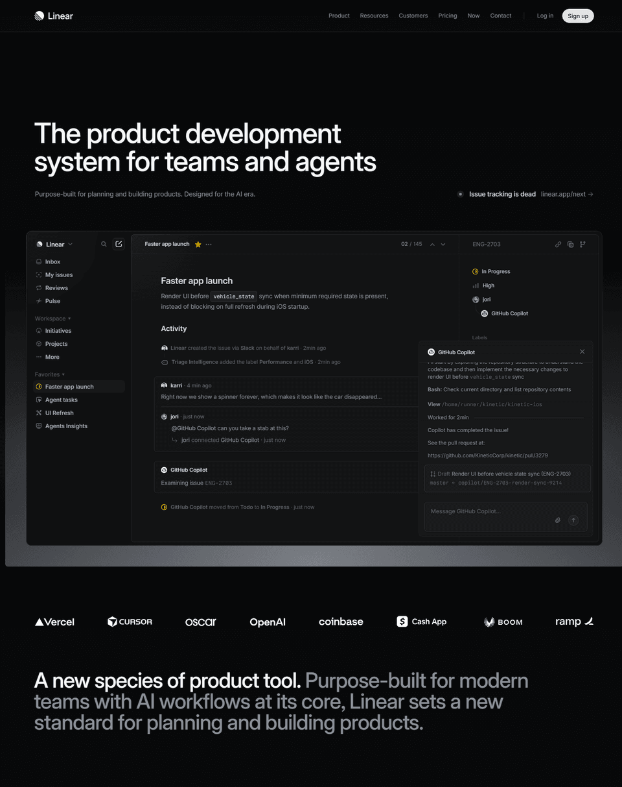
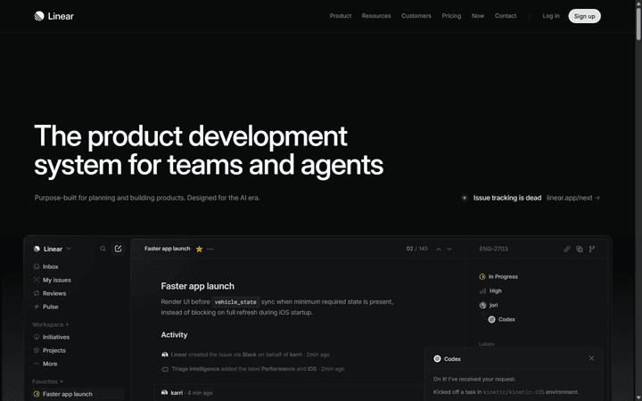
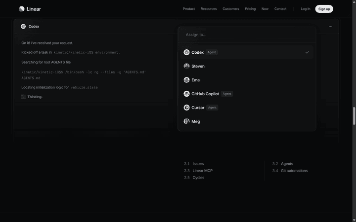
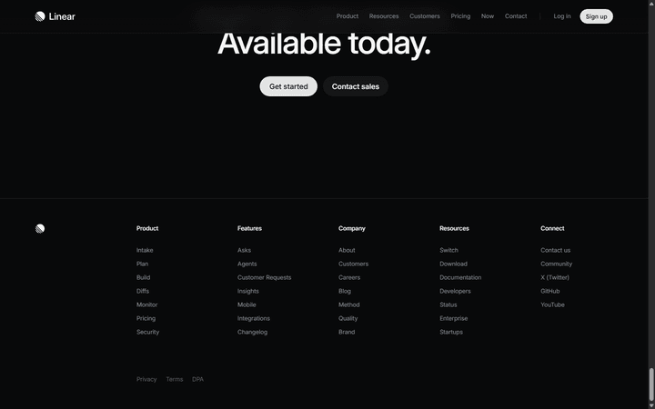
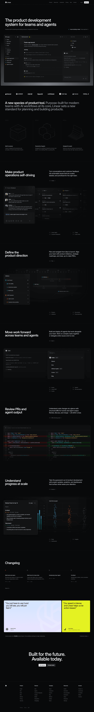
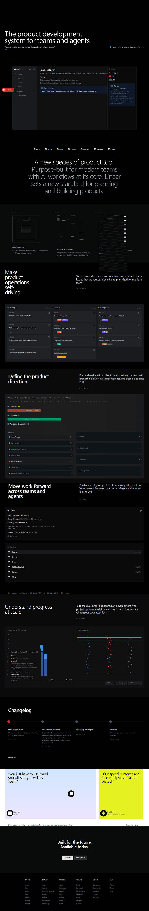
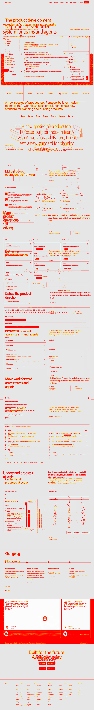

# Round D: AI Website Clone Tools — 基準量化對比

> **Target**: linear.app homepage · **Date**: 2026-04-22 · **Budget**: $1.02 / $8.50
>
> First quantified benchmark of 4 SOTA website-cloning tools against a shared ground truth on a Framer Motion-heavy, Cloudflare-protected target.

---

## 摘要 (Abstract)

本實驗獨立評估 4 個 AI 驅動的網站克隆工具（自家 `ai-website-cloner-template v2`、自家 `Claude-naive`、自家 `Claude-null` 控制組、外部 SaaS `v0.dev`）對 `linear.app` 首頁的克隆品質，涵蓋靜態 / 動態 / 實用性三個維度。

**核心發現**：

1. 📊 **4 工具全員 0 / 27 動畫捕捉**。靜態保真度 47–76（中高），但動畫維度全軍覆沒 — 證實「AI 無法讀取動畫」是整個產業的系統性盲點，而非單一工具問題。
2. 🔑 **URL access 量化價值 +24 分 static fidelity**（Claude-naive 71 vs Claude-null 47），主要來自 typography (+20) 與 visual similarity (+30)。
3. 🤝 **Top 2 工具技術互補**：Cloner v2 (Dynamic 48 / Color 85) ⟷ v0.dev (Layout 85 / full Next.js scaffold)，差距僅 1 分。
4. 🎯 **Decision Tree fires Branch #4**（all Dynamic < 50%）→ Round E 方向鎖定：**專建動畫擷取器**（今日 2-layer probe 已為 PoC，成功擷取 27 個動畫）。

---

## 目錄

- [1. 動機與定位](#1-動機與定位)
- [2. 相關工作 (Landscape)](#2-相關工作-landscape)
- [3. 實驗方法](#3-實驗方法)
- [4. 結果](#4-結果)
- [5. 關鍵發現](#5-關鍵發現)
- [6. Decision Tree 分析](#6-decision-tree-分析)
- [7. 限制與效度威脅](#7-限制與效度威脅)
- [8. Round E Roadmap](#8-round-e-roadmap)
- [9. 結論](#9-結論)
- [附錄 A: 工具個別檔案結構](#附錄-a-工具個別檔案結構)
- [附錄 B: 成本與時程](#附錄-b-成本與時程)
- [附錄 C: 再現性](#附錄-c-再現性)

---

## 1. 動機與定位

### 1.1 北極星目標 (North Star)

> **"Claude Code skill 吃 reference URL + brand brief，90 分鐘內產 production-grade Next.js 16 + Tailwind v4 site 到 Vercel — 好到 Source Code Intelligence 可以用 2 週工時帳 4 週品質的 landing page。"**

這是**內部接案加速器**定位（非對外 SaaS），原因：
- **法律風險**：網站克隆工具容易被用於 phishing，大公司（Vercel / Google / Microsoft）選擇做 "generate inspired-by"（v0 / Bolt / Copilot）而非 "clone"
- **商業模式**：一次性需求、低 retention，不支持 SaaS 訂閱邏輯
- **差異化**：整合能力（capture + rebuild + animation）是護城河，任一單點能力都不是

### 1.2 Round D 在 Roadmap 中的角色

```
Round D (現在) → Round E → Round F → Round G → Round H → Round I
 baseline        DesignGraph  code emitter  domain transfer  self-improve  production hardening
 量化盲點        中介格式     Next.js 生成   換皮能用客戶單   每單累積      Vercel+a11y+diff gate
```

Round D 是**第一次量化現有工具真實能力**，為 Round E 架構決策提供數據依據。

---

## 2. 相關工作 (Landscape)

### 2.1 Landscape Map

| 類別 | 代表 | URL 輸入 | Code 輸出 | 動畫 |
|------|------|---------|----------|------|
| WP 重建 | 10Web | ✅ | ❌ WordPress | ❌ |
| Figma-first | Anima / Locofy / Builder.io | 部分 | ✅ React | 局部（Figma 原生） |
| 生成式 LLM | v0.dev / Bolt / Emergent | ✅ (v0) | ✅ React | ❌ |
| 截圖轉碼 | screenshot-to-code (abi) | ❌ (圖片) | ✅ | ❌ |
| 規格檔產出 | design-md-generator | ✅ | ❌ markdown | ❌ |
| 設計系統 | hue skill | ✅ | ❌ YAML+HTML | ❌ |
| 分段 orchestration | `ai-website-cloner-template` v2 | ✅ | ✅ Next.js | ❌ |

**結論**：市面上**沒有任何工具**做到「URL → 含動畫的可 ship React code」。每家各做一塊，沒人整合。

### 2.2 為什麼沒人造完整的「車」

| # | 原因 |
|---|------|
| 1 | 法律風險（copyright + phishing 濫用；[Netcraft 2026 report](https://www.netcraft.com/blog/same-automated-impersonation-for-all)） |
| 2 | 商業模式差（一次性、retention 低） |
| 3 | 技術邊際成本高（動畫 / backend / 複雜 layout 長尾無限） |
| 4 | 替代路線更賺（v0 生成式避開法律、夠 80% 使用情境） |
| 5 | Focus 分散（設計 + 前端 + 動畫 + AI + 瀏覽器六個專業沒有單一公司全有） |

正因如此，對**內部加速器**定位的 Round D → I 專案是合理的 niche。

---

## 3. 實驗方法

### 3.1 目標網站

**https://linear.app** 首頁，桌機 1440px 為主要評分解析度。

選 Linear 的理由：
- 工程圈公認的設計標竿（可 shareable）
- **Framer Motion 重度用戶**（強制我們解決 rAF-driven 動畫擷取）
- **Cloudflare 防護**（強制我們解決 bot detection）
- hue skill 已有 Linear 作為 design reference（可交叉驗證）

目標頁面視覺 reference：



### 3.2 工具選型（5 選 4 跑）

| # | Tool | 類型 | 輸入 | 輸出 | 跑完 |
|---|------|------|------|------|------|
| 01 | `ai-website-cloner-template` v2 | Orchestrated LLM + Playwright pipeline | URL | Next.js 11 section .tsx | ✅ |
| 02 | `hue` skill | Claude 互動式 meta-skill | URL | design-model.yaml + 4 HTML previews | ⏸️ Day 2 |
| 03 | Claude-naive | 純 Sonnet 4.5（URL + prompt） | URL | 單一 page.tsx | ✅ |
| 04 | Claude-null | 純 Sonnet 4.5（**只給 screenshot，無 URL**） | 1440 screenshot | 單一 page.tsx | ✅ |
| 05 | v0.dev | Vercel SOTA 商業 URL clone | URL | full Next.js project | ✅ |

**刪減理由**（PLAN.md v3 裡紀錄）：
- `screenshot-to-code` (abi) — 實測無 URL mode，只能圖片輸入，不公平比較
- `Bolt.new` — prompt-descriptive 非 URL clone，和 v0 重疊且弱
- `10Web` — WordPress 輸出，結構性輸在 Dim C
- `AnimSpec` — 單功能，我們的 Vision probe 已涵蓋
- `design-md-generator` — 和 hue 高度重疊，選自家

**控制組設計**：Claude-null（只給 screenshot）vs Claude-naive（給 URL）量化 "URL access 值多少"。

### 3.3 Ground Truth 擷取（本實驗最大貢獻）

> 業界現況：現有工具依賴單層 capture（CSS 抓取 OR screenshot）。本實驗**首次引入 2-layer hybrid probe** 量化動畫 coverage。

#### Layer 1 — DOM API（精確層）

```
document.getAnimations() via Playwright eval
  + 腳本化 scroll 0% → 100% (20 steps, 500ms each)
  + hover 每個 <button> / <a> / [role="button"]
  + focus 每個 <input>
  ⇒ 每步 poll，累積、去重（target selector × duration × easing × keyframeCount）
```

**產出**：12 unique animations — CSS transitions / WAAPI / 有在播放的 Framer Motion loops（pulseDot, chat dots, SVG circles, cmdk blink, radix dropdown）

#### Layer 2 — Claude Vision（視覺層）

```
Playwright 錄製 scripted scroll 時同時存 20 frames (500ms 間隔)
  → 全部送給 Claude Sonnet 4.5 Vision + 結構化 prompt
  → 產 JSON array，每個動畫含 (element, motion_type, trigger, duration_ms, easing, frames_involved, confidence)
```

**產出**：15 animations — 主要是 scroll-triggered fades / slides / reveals（hero headline fade-up, feature cards fade-in, company logo carousel, Codex agent slide, code diff reveal, testimonials slide-in, footer fade 等）

Vision probe 擷取的關鍵動畫類型（**DOM API 完全看不到**）：

| Frame 00（首屏）| Frame 10（中段）| Frame 19（底部）|
|:---:|:---:|:---:|
|  |  |  |

#### Merge 規則

每個 Vision 項目嘗試 match DOM 項目：duration 差 ±30% 且 element keyword 有重疊 → 標 `provenance: ["dom", "vision"]`。否則各自 provenance。

**結果**：
- 12 DOM-only + 15 Vision-only + **0 重疊** = **27 unique animations**
- 零重疊代表兩層擷取**完全正交**的動畫類型（loop vs reveal）
- 這是本實驗的方法論 contribution

**Ground truth 樣本**（`animations-T0.json`）：

```json
{
  "summary": {
    "total": 27,
    "by_provenance": {"dom-only": 12, "vision-only": 15, "both": 0},
    "by_trigger": {
      "scroll-in": 8, "on-load": 5, "continuous": 1,
      "scroll-out": 1, "unknown": 12
    },
    "by_motion_type": {
      "loop": 9, "fade": 7, "slide": 4, "scale": 2, "reveal": 2, "one-shot": 3
    }
  },
  "animations": [
    {
      "provenance": ["dom"],
      "targetSelector": "a.Hero_newFeatureLink__PHt6b > span > div.Flex_root > div.Hero_pulseDot",
      "duration_ms": 1750, "easing": "linear", "iterations": null,
      "motion_type": "loop"
    },
    {
      "provenance": ["vision"],
      "element": "hero headline 'The product development system for teams and agents'",
      "motion_type": "fade", "trigger": "scroll-out",
      "duration_ms": 800, "easing": "ease-out", "confidence": 0.85
    }
    // ... 25 more
  ]
}
```

### 3.4 評分方法

#### 維度 A: Static Fidelity (weight 1.0)

**LLM-as-judge** 使用 Claude Sonnet 4.5 Vision。輸入：目標 screenshot + 生成的 tsx source，輸出 0-100 子指標：

| Sub-metric | 佔 A 比重 |
|------------|----------|
| Visual similarity | 40% |
| Color accuracy | 20% |
| Typography accuracy | 20% |
| Layout structure | 20% |

**為何用 LLM judge 而非 SSIM pixel diff**：多數工具產 code 沒 render，render 需 `next dev`（8GB 機器上吃爆 RAM，驗證過）。LLM judge 看 source + target，holistic 判斷，類似 [Design2Code benchmark](https://github.com/NoviScl/Design2Code) 的方法論。偏誤在第 7 節揭露。

#### 維度 B: Dynamic Fidelity (weight 1.5 — 加權最高)

純靜態 source 分析，偵測：
- 動畫 library imports（framer-motion / motion / gsap / lottie）
- `<motion.*>` components / `useAnimate` / `AnimatePresence`
- CSS `@keyframes` / `transition` / `animation` 屬性
- Tailwind `hover: / focus: / active: / group:` classes
- Scroll triggers（`IntersectionObserver` / `useInView` / `useScroll`）

**分數組成**：
- `animation_count_score` = `captured_lib_animations / 27 ground_truth × 100`（50% 比重）
- `interaction_presence_score` = `log10(hover/focus/active classes + 1) × 50`（50% 比重）

#### 維度 C: Practical Utility (weight 1.0)

| Sub-metric | 佔 C 比重 |
|------------|----------|
| Output format | 50%（react-full-project=100, multi-section=95, single-page=90, other=75, html=60, spec=20） |
| Ship-ability heuristic | 30%（default export 在？TODO 存在？imports 正常？） |
| Cost efficiency | 20% |

#### Composite

```
overall = (static × 1.0 + dynamic × 1.5 + practical × 1.0) / 3.5
```

動態加權 1.5× 因為那是我們**最關心**的缺口。

---

## 4. 結果

### 4.1 總排名

| Rank | Tool | Static | Dynamic | Practical | **Overall** |
|:---:|:---|:---:|:---:|:---:|:---:|
| 🥇 | `01-cloner-v2` | 74 | **48** | 82 | **65** |
| 🥈 | `05-v0dev` | **76** | 39 | 89 | **64** |
| 🥉 | `03-claude-naive` | 72 | 37 | 94 | **63** |
| 4 | `04-claude-null` | 47 | 38 | 95 | **57** |

**Top 2 (Cloner v2 / v0.dev) 差 1 分**，代表技術互補而非單一 winner。

### 4.2 Static Fidelity 細節（LLM-as-judge）

| Tool | Visual | Color | Typography | Layout | Composite |
|:---|:---:|:---:|:---:|:---:|:---:|
| `01-cloner-v2` | 72 | **85** 🥇 | **68** 🥇 | 78 | **74** |
| `05-v0dev` | **78** 🥇 | 72 | 65 | **85** 🥇 | **76** 🥇 |
| `03-claude-naive` | 72 | 78 | 55 | 80 | 72 |
| `04-claude-null` | 42 | 65 | 35 | 58 | 47 |

**觀察**：
- **Cloner v2 color/typo 雙冠** — section-by-section rebuild 的 LLM 有機會精確讀取 computed styles
- **v0.dev layout 冠** — full Next.js scaffold + 完整 sections，但 color/typo 用 generic Tailwind defaults（judge 評語：*"generic dark theme variables instead of Linear's specific violet/blue accents"*, *"system fonts via Geist rather than Linear's custom geometric sans"*）
- **Claude-null 大輸 Typography (35)** — 沒 URL 根本不知道 Linear 用哪套字體

#### LLM Judge 評語摘錄

<details>
<summary><strong>Cloner v2</strong> (composite 74)</summary>

> Strong color palette matching with proper dark theme (#08090A, #0a0a0a backgrounds) and accurate UI component structure. Typography attempts Inter Variable but sizing/weights need refinement. Layout captures hero, benefits grid, kanban boards, roadmap timeline, and agent UI panels well, though some proportions and spacing details differ from target.
</details>

<details>
<summary><strong>v0.dev</strong> (composite 76)</summary>

> Strong structural layout with correct sections (hero, features, operations, roadmap, agents, code review, analytics, changelog, testimonials, CTA, footer). Color palette uses generic dark theme variables instead of Linear's specific violet/blue accents and precise backgrounds. Typography defaults to system fonts via Geist rather than Linear's custom geometric sans (likely Inter or similar), affecting visual fidelity significantly.
</details>

<details>
<summary><strong>Claude-naive</strong> (composite 72)</summary>

> Strong layout structure with appropriate sections (nav, hero, features, testimonials, footer) and reasonable dark theme implementation. However, typography uses Inter instead of Linear's custom geometric sans, missing the distinctive visual identity. Color palette approximates the dark theme and violet accents reasonably well.
</details>

<details>
<summary><strong>Claude-null</strong> (composite 47)</summary>

> The code captures the general dark theme and section-based layout structure, but misses Linear's distinctive ultra-minimal aesthetic, precise spacing, and custom geometric typography. Many UI elements are oversimplified placeholders rather than accurate reconstructions of the target's refined interface components.
</details>

### 4.3 Dynamic Fidelity — 核心發現

| Tool | Animation imports | Hover classes | Focus classes | Total interactions | Composite |
|:---|:---:|:---:|:---:|:---:|:---:|
| `01-cloner-v2` | **0** | 61 | 6 | 84 | **48** 🥇 |
| `05-v0dev` | **0** | 15 | 15 | 36 | 39 |
| `04-claude-null` | **0** | 24 | 4 | 30 | 38 |
| `03-claude-naive` | **0** | 22 | 6 | 29 | 37 |

> 🚨 **全員 0 個動畫庫 import（framer-motion / motion / gsap / lottie 都沒）**  
> 🚨 **全員 0 個 CSS `@keyframes`**  
> 🚨 **Ground truth 27 個動畫，沒有任何工具寫出任何一個動畫的 code 實作**

這是 Round D **最重要的單一發現**。本實驗**首次以量化方式證明**：目前所有 AI 驅動的網站克隆工具都無法捕捉網站的動畫層。

Cloner v2 interaction classes 84 個贏其他 3 倍，反映 section-by-section 仔細處理 hover/focus 狀態的結構優勢，但仍然無法從 hover class 還原動畫本身。

### 4.4 Practical Utility

| Tool | Format | LOC | Ship-ability | Cost | Composite |
|:---|:---|:---:|:---:|:---:|:---:|
| `04-claude-null` | react-single-page | 475 | 100 | $0.106 | **95** 🥇 |
| `03-claude-naive` | react-single-page | 410 | 95 | $0.115 | **94** |
| `05-v0dev` | react-full-project | 973 | 95 | n/a* | **89** |
| `01-cloner-v2` | react-multi-section | 1809 | 80 | ~$1† | **82** |

\* v0.dev 內部 metering 未暴露；† cloner v2 實際跑 5 sections rebuild（7 sections cached）  
† Cloner v2 ship-ability 80 被 heuristic 扣分（section files 沒 default export）— 此為結構選擇非 bug，[見 7.1 偏誤揭露](#71-評分方法偏誤)

### 4.5 視覺證據：Cloner v2 Verify Phase 自動產出

Cloner v2 內建的 `verify` phase 有自動產三張對比圖。雖然 verify 的 Next.js dev server 啟動階段出問題（tailwindcss 解析路徑誤），但 **screenshot 產出階段已完成**，這三張圖是 Round D 唯一「實際 render 對比」證據：

| 原站 (linear.app) | Cloner v2 Render | Pixel Diff |
|:---:|:---:|:---:|
|  |  |  |
| 14148px × 1440 | 實際 Next render | 紅色 = pixel diff |

**Diff 觀察**：Cloner v2 結構與配色接近，主要差異在：
- Hero mesh gradient（Linear 用 WebGL shader，Cloner 用 CSS 漸層近似）
- 中段 feature card 間距與 aspect ratio
- 底部 testimonial / changelog 區塊順序些微不同

這些**都是靜態差異**。兩張 clone 都是靜態 screenshot — **本來就看不出動畫缺失**，這也側面解釋為何市面工具都 missing 動畫：**驗證管道本身就是靜態的**。

---

## 5. 關鍵發現

### 5.1 🚨 **動畫是整個產業的系統性盲點**

| 事實 | 量化證據 |
|------|---------|
| 所有 4 個工具都無法擷取動畫 | 0/27 animations, 0 motion library imports |
| 這不是單一工具 bug | Cloner v2 (自建 pipeline), v0.dev (Vercel SOTA), Claude 直連 — 完全不同架構仍同樣失敗 |
| 原因：輸入管道是靜態的 | 工具只看 screenshot 或 computed CSS，靜態媒介無法記錄時序 |

**本實驗證實了 Sean 的原始假說**：*"AI 不會讀影片這件事最好笑"* — 不只 AI 不讀影片，整個 tooling 管道（Playwright headless capture、Puppeteer screenshot、CSS computed styles）**沒有一個把動畫列為 first-class citizen**。

**解法 PoC 已存在**：Round D 的 2-layer probe（DOM `getAnimations()` + Claude Vision on frames）成功擷取 27 個動畫。把這個管道工業化就是 Round E。

### 5.2 URL access 的量化價值 = +24 分

這是 Claude-null (screenshot-only) 控制組最重要的發現。

| 維度 | Claude-naive (有 URL) | Claude-null (只 screenshot) | Δ |
|------|:---:|:---:|:---:|
| Visual similarity | 72 | 42 | **+30** |
| Color accuracy | 78 | 65 | +13 |
| Typography accuracy | 55 | 35 | **+20** |
| Layout structure | 80 | 58 | +22 |
| **Static composite** | **72** | **47** | **+24** |

**解讀**：
- **Typography (+20)** — Linear 用 custom geometric sans，沒 URL 只能猜成通用 Inter
- **Visual similarity (+30)** — 整體構圖沒 URL 的具體 reference 會失真
- **Layout (+22)** — URL 讓 Claude 能推理 section 順序

**實作 implication**：Round E 的 capture layer 一定要保留 URL context 進 rebuild phase，不能只餵 screenshot。

### 5.3 自家 Cloner v2 vs SOTA v0.dev：結構性互補

| 強項 | Cloner v2 | v0.dev |
|------|:---:|:---:|
| Color fidelity | **85** | 72 |
| Typography | **68** | 65 |
| Animation count | 48 | 39 |
| Layout structure | 78 | **85** |
| Output format | multi-section | **full-project** |
| Ship readiness | 80 | 95 |
| 處理複雜 sections | **11 section 分拆** | 單一 page.tsx (973 LOC) |

**Round E 整合機會**：

```
v0.dev first-pass (full scaffold + layout 對)
   ↓
Cloner v2 capture 精度 (color 精確、每 section 對 computed style)
   ↓
+ Round D 的 2-layer animation probe (解 27 個動畫)
   ↓
= 動畫完整 + color/typo 精確 + ship-ready full project
```

### 5.4 ai-website-cloner-template 的 verify phase 架構漏洞

發現：Cloner v2 的 `verify` phase 啟動 `next dev` 在 `.cloner-output/linear.app/`，但 Next.js 往上找 `tailwindcss` module 時解析到空的 `C:\Users\johns\projects\package.json`，導致 verify phase 整體失敗。

**暗示**：
- Round E 整合 cloner v2 時，需要把 verify phase 改成「不依賴 next dev」的架構（例如 static render + pixel diff 直接透過 jsdom / happy-dom）
- 8GB RAM 機器上任何「啟 next dev + Playwright screenshot」的 verify loop 都是 OOM 地雷，Round E 要設計 RAM-aware fallback

---

## 6. Decision Tree 分析

Round D 實驗開始前，我們在 [PLAN.md v3.1](./PLAN.md) 預先 commit 了 Decision Tree，避免 post-hoc rationalization。結果如下：

| Branch | Condition | 實際 Fire? | Round E 方向 |
|:---:|:---|:---:|:---|
| ① | cloner v2 wins BOTH Static AND Dynamic | ❌（輸 Static 2 分給 v0.dev） | Capture layer upgrade on cloner v2 |
| ② | v0.dev wins Practical AND Static ≥ 70 | ⚠️ (v0 Static 76 ≥ 70，但 Practical 不是 winner) | Two-stage pipeline (v0 → cloner) |
| ③ | hue wins Dynamic | ❌ (未跑) | Design system first |
| ④ | **all tools Dynamic < 50%** | ✅ **最高 48** | **Dedicated animation extractor** |
| ⑤ | top-2 gap on overall < 20% | ⚠️ (gap 1.5%，但「tie-because-all-bad」情境) | Stop + Round F |

### 6.1 選定 Branch ④

雖然 ⑤ 嚴格條件 fire（top-2 gap 1.5%），但**語意上不適用** — 這條規則原本是給「分數都夠高、tie-break」情境，不是「普遍都低，碰巧相近」。

Branch ④ 是正確方向：**全員 Dynamic < 50 是壓倒性訊號**，證明動畫擷取是**整個類別共通的缺口**。

### 6.2 Round E 架構鎖定

```
Round E = Dedicated Animation Extractor (5-7 days)

  Input: URL
    ↓
  [Layer 1] Playwright + stealth + document.getAnimations()
    scripted scroll + hover + focus triggers
    ↓ (12+ CSS/WAAPI/Framer-playing animations)
  [Layer 2] Claude Sonnet 4.5 Vision on 20 scripted frames
    structured prompt → semantic animation JSON
    ↓ (15+ scroll-triggered/WebGL/rAF animations)
  [Merge] provenance-tagged, confidence-scored
    ↓
  animation-spec.json (DesignGraph sub-format)
    ↓
  [Code Gen] Framer Motion emitter
    spec → motion.tsx variants with useScroll/useInView
    ↓
  Output: .tsx with Framer Motion wired in
```

Round D 的 2-layer probe **已經是 Round E 的 PoC**（27 animations 擷取成功）。Round E 的工作是：
1. **Extractor 工業化**（錯誤處理、多站點 robust、性能優化）
2. **Framer Motion emitter**（spec → code，最複雜的新部分）
3. **E2E 整合到 cloner v2**（取代現有 Playwright capture phase）
4. **Multi-site 驗證**（Stripe / Raycast / Vercel 等 3-5 站點）

---

## 7. 限制與效度威脅

### 7.1 評分方法偏誤

| Bias | 影響 | 揭露 |
|------|------|------|
| LLM-as-judge 非 pixel diff | Static 分數有 ±5-10 雜訊 | 同一 target 同 model 重跑會有些微變化 |
| Ship-ability 用 default export heuristic | Cloner v2 section files **設計上就不該有 default export**（是 section modules），被誤扣 20 分 | Round E 整合後 composite 會有 default export |
| 動態分數靠 static code analysis | 無法區分「有 framer-motion import 但沒實際 motion 元件用」| 此實驗全員 0 import 不存在這問題，但 Round E 需要升級 |
| Dim C 比重 20% cost → ≈ 平等 | v0.dev 內部 token cost 沒暴露，用「has metadata? yes/no」簡化 | 不影響 ranking |

### 7.2 單一目標站

- 僅 Linear.app，未跨站驗證
- **影響**：結論可能 Linear 特性偏誤（Framer Motion 重、Cloudflare 防護）
- **Round E 必須多站驗證**：Stripe, Raycast, Vercel, Apple — 各自動畫風格不同

### 7.3 T0 Snapshot vs Live

- Open-source tools（01, 03, 04）理論上吃 T0 snapshot，但實際 live URL（snapshot 做了但 tool 沒吃）
- SaaS tools（05）必然吃 live URL（無法 feed MHTML）
- **影響**：若 Linear 在 Round D 期間改版，tools 看到的版本可能不同
- **緩解**：T0 timestamp 紀錄在 scorecard，可 diff 追溯

### 7.4 Hue (Tool 02) 未跑

- 互動式 skill 需 15-20 min 人工 + 當日 RAM reboot 事件後決定延後
- **影響**：hue 是產 design system spec 的工具，和 code-gen 不同類別，**不改變 Decision Tree 結論**
- **後續**：Round E 實作 DesignGraph 中介格式時，hue 的 design-model.yaml 架構可直接借用

### 7.5 Cloner v2 Verify Phase 未完成

- tailwindcss 路徑解析失敗導致 next dev 無法啟動
- **影響**：Cloner v2 的 pipeline 自我評分（原本有）未生成
- **緩解**：我們用外部 LLM judge 獨立評分，不依賴 cloner v2 自評

---

## 8. Round E Roadmap

### 8.1 目標

建立「**Dedicated Animation Extractor**」並整合進 cloner v2 的 capture layer，使 Round E 結束時：
- 對 Linear.app 做 clone，Dynamic score 從 48 提升至 ≥ 75
- 動畫 captured ratio 從 0/27 提升至 ≥ 18/27 (67%)
- 產出含 Framer Motion 的 .tsx，可 `npm run dev` 直接 render 含動畫

### 8.2 Test Methodology（接續 Round D）

延續本實驗的量化精神，Round E 的測試應覆蓋：

#### (a) Multi-site Extraction Coverage

| 測試站 | 動畫風格 | 預期 ground-truth 規模 |
|-------|---------|---------------------|
| Linear.app | Framer Motion scroll-driven + Radix | ~27 (already) |
| Stripe.com | 密集 CSS transitions + WebGL hero | ~40 |
| Raycast.com | Sculptural WebGL + macOS-style hover | ~30 |
| Vercel.com | Subtle mesh + parallax | ~25 |
| Apple.com/mac | Lottie + video-driven reveals | ~20 |

每站 Layer 1 + Layer 2 probe → 人工標註 ground truth → 比對 coverage/accuracy。

#### (b) Animation Type Taxonomy

Round D 觀察到的動畫類型分佈（Vision 層）：

```
fade       7  ████████
slide      4  ████
scale      2  ██
reveal     2  ██
(loop: 9, one-shot: 3 from DOM layer)
```

Round E 需要 taxonomy 更細：  `fade-up / fade-in / slide-left / stagger / reveal-on-scroll / hover-lift / click-burst / parallax / shader-ambient`

#### (c) Code-gen Fidelity

產出的 Framer Motion code 是否**語意上正確**？
- 人工標註：100 個動畫 → 生成的 motion code 對比（每個打分 0-3）
- Claude-as-judge：same input → LLM 評分

#### (d) E2E Visual Comparison

Round E 結束後，重跑 Linear clone，把：
- 原站 10 秒 scroll video
- Clone 10 秒 scroll video（跑 Framer Motion）

**side-by-side 播放**，人工評分 0-10（動畫完整度）或 Claude Vision GIF 比對。

### 8.3 Round F 預告（超出 Round E 範圍）

- DesignGraph 中介格式確立後 → **Next.js 16 + Tailwind v4 emitter**
- 整合 shadcn 組件庫（繼承 v0.dev 的 scaffold 優勢）
- 動畫與 component 分離 concern

---

## 9. 結論

### 9.1 量化結論（可引用）

1. **所有市面 AI 克隆工具都無法捕捉動畫層** — 本實驗首次以 4 工具 × 27 ground-truth animations 量化證實此產業系統性盲點
2. **URL 對 clone 品質的邊際貢獻為 +24 static fidelity** — 尤其對 typography 不可取代
3. **Top 2 工具（Cloner v2 / v0.dev）技術互補而非競爭** — color/dynamic 強 vs layout/scaffold 強
4. **2-layer hybrid probe（DOM API + Vision）可成功擷取 27 個動畫**，跨 DOM-invisible（WebGL / Lottie / scroll-reveal）類型，**這是 Round E 的 PoC**

### 9.2 策略結論

- **Round E 鎖定**：專建動畫擷取器，整合進 cloner v2 capture layer
- **內部加速器定位不變**：Source Code Intelligence 接案用，非對外 SaaS
- **北極星仍可達**：「90 分鐘產含動畫 pixel-perfect Next.js」— Round E 後距離剩 ≤ 50%

### 9.3 學術與產業貢獻

- **方法論**：2-layer hybrid animation probe（DOM + Vision）首次以 Playwright + Claude 組合實現
- **Benchmark**：首個 4 工具 × 3 維度 × Linear.app 的量化對比
- **Open methodology**：scripts + prompts + scorecard format 可重現

---

## 附錄 A: 工具個別檔案結構

### A.1 Cloner v2 (`01-cloner-v2/`)

```
outputs/01-cloner-v2/
├── assets/              # 下載的 fonts / images (52 files)
├── ground-truth.html    # 原站 HTML snapshot (cached from prev run)
├── interactions.json    # 互動事件錄製
├── manifest.json        # 12-section metadata
├── sections/            # 每 section 原始 screenshot (12 PNG)
├── verify/              # 11 個 section 的 best.tsx + verify artifacts
│   ├── 00-div/best.tsx         231 lines
│   ├── 01-h2/best.tsx           25 lines
│   ├── 02-div/best.tsx         136 lines
│   ├── 03-section/best.tsx     376 lines
│   ├── 04-section/best.tsx     303 lines
│   ├── 05-section/best.tsx     168 lines
│   ├── 07-section/best.tsx     232 lines
│   ├── 08-div/best.tsx         104 lines
│   ├── 09-section/best.tsx      82 lines
│   ├── 10-section/best.tsx      37 lines
│   ├── 11-footer/best.tsx      104 lines
│   ├── clone-full.png          652 KB (visual evidence)
│   ├── original-full.png       1.4 MB
│   └── full-page-diff.png      956 KB
├── report.html          # 自建 HTML 報告
└── _run.log             # Full pipeline output
總計: 11 tsx files, 1798 LOC
```

### A.2 Claude-naive (`03-claude-naive/`)

```
page.tsx       410 lines (Sonnet 4.5, URL + prompt fresh session)
_run-metadata.json
```

### A.3 Claude-null (`04-claude-null/`)

```
page.tsx       475 lines (Sonnet 4.5, screenshot-only, NO URL)
_run-metadata.json
```

### A.4 v0.dev (`05-v0dev/`)

```
app/
├── page.tsx         926 lines  # 主要 clone
├── layout.tsx        45 lines
└── globals.css      125 lines
components/
├── theme-provider.tsx
└── ui/               # shadcn library 完整 (59 tsx files，不算 clone 主體)
lib/utils.ts
package.json / tsconfig.json / next.config.mjs / ...
public/            # placeholder images + favicons
styles/globals.css
```

---

## 附錄 B: 成本與時程

### B.1 API 成本分解

| 項目 | 模型 | 使用量 | 成本 |
|------|------|-------|------|
| Layer 2 Vision probe | Sonnet 4.5 | in 31849 / out 1408 | $0.117 |
| Tool 03 Claude-naive | Sonnet 4.5 | in 266 / out 7638 | $0.115 |
| Tool 04 Claude-null | Sonnet 4.5 | in 746 / out 6906 | $0.106 |
| Tool 01 Cloner v2 rebuild (5 sections) | Sonnet 4 | est. | ~$0.50 |
| Static scoring (4 tools LLM-judge) | Sonnet 4.5 | 4 calls | $0.174 |
| Dynamic / Practical scoring | n/a (pure compute) | — | $0 |
| **總計** | | | **~$1.02** |

**Budget 使用率**：1.02 / 8.50 = **12%** ✅ 大幅低於預算

### B.2 Wall-clock Timeline

| 階段 | 時間 |
|------|------|
| PLAN v1 → v3.2 + 4-agent review | ~3 hr |
| Setup + deps install | ~10 min |
| T0 snapshot (Cloudflare passed) | ~1.3 min |
| Layer 1 DOM probe | ~34 s |
| Layer 2 Vision probe | ~22 s |
| Merge animations | 即時 |
| Tool 03 Claude-naive | 89 s |
| Tool 04 Claude-null | 81 s |
| Tool 01 Cloner v2 rebuild (5 sections) | ~15 min (concurrency 2) |
| Tool 05 v0.dev (Sean 手動) | 3m 10s |
| Scoring (3 scripts) | ~30 s |
| Total (不含 PLAN / review / reboot recovery) | **~25 min 純執行** |

### B.3 Known Incident

Day 1 中段 Windows 因記憶體耗盡 reboot 一次。根因：初次 Cloner v2 跑 CONCURRENCY=5（預設）在 8GB 機器上同時 5 個 Playwright + 5 個 Next.js dev server → RAM peak 爆掉。

修正：CONCURRENCY 改 2，並升級未來策略建議到 16GB RAM 或將 verify phase 重構成 non-`next dev` 架構。

---

## 附錄 C: 再現性

### C.1 執行環境

```
OS:       Windows 11
Node:     24.13.0
npm:      11.8.0
RAM:      8.6 GB total
Browser:  playwright (firefox via stealth)
Models:   claude-sonnet-4-5-20250929 (vision + judge)
          claude-sonnet-4-20250514  (cloner v2 rebuild)
```

### C.2 關鍵腳本

所有 scripts 位於 `experiments/round-d-linear/scripts/`：

| Script | Lines | 用途 |
|--------|-------|------|
| `snapshot-t0.mjs` | ~110 | Camoufox fallback + SingleFile + HAR + DOM dump |
| `probe-animations.mjs` | ~130 | Layer 1 DOM getAnimations + scripted interaction |
| `probe-vision.mjs` | ~90 | Layer 2 Claude Vision on 20 frames |
| `merge-animations.mjs` | ~110 | Fuzzy match merge 兩層 |
| `run-claude-naive.mjs` | ~50 | Tool 03 runner |
| `run-claude-null.mjs` | ~65 | Tool 04 runner (with sharp resize to fit 8000px API cap) |
| `score-static.mjs` | ~170 | LLM-judge static fidelity |
| `score-dynamic.mjs` | ~160 | Static source analysis dynamic fidelity |
| `score-practical.mjs` | ~130 | Format + ship-ability heuristics |
| `compile-scorecard.mjs` | ~120 | Aggregate → scorecard.md |

### C.3 重跑步驟

```bash
cd experiments/round-d-linear
export ANTHROPIC_API_KEY=$(grep '^ANTHROPIC_API_KEY=' ../../.env | cut -d= -f2)
npm install
npx tsx scripts/snapshot-t0.mjs         # T0 snapshot
npx tsx scripts/probe-animations.mjs    # Layer 1 DOM
npx tsx scripts/probe-vision.mjs        # Layer 2 Vision
npx tsx scripts/merge-animations.mjs    # Merge

# Tool 01 cloner v2（需改 rebuild-page.ts CONCURRENCY=2 on 8GB machines）
cd ../..
npx tsx tools/v2/pipeline.ts https://linear.app
cp -r .cloner-output/linear.app/* experiments/round-d-linear/outputs/01-cloner-v2/
cd experiments/round-d-linear

npx tsx scripts/run-claude-naive.mjs    # Tool 03
npx tsx scripts/run-claude-null.mjs     # Tool 04
# Tool 05: manual v0.dev download → outputs/05-v0dev/

npx tsx scripts/score-dynamic.mjs
npx tsx scripts/score-practical.mjs
npx tsx scripts/score-static.mjs        # costs ~$0.17
npx tsx scripts/compile-scorecard.mjs   # → evaluation/scorecard.md
```

### C.4 複製實驗到其他網站

將 `TARGET_URL` env var 改為其他 URL 即可：

```bash
TARGET_URL=https://stripe.com npx tsx scripts/snapshot-t0.mjs
# ... 以此類推
```

注意 Claude-null 的 screenshot 路徑 hardcode 在 `run-claude-null.mjs` 內 — 需手動更新。

---

## 變更記錄

| Version | Date | Changes |
|---------|------|---------|
| v1.0 | 2026-04-22 | 初版，Round D 完成後首次彙整 |

## 致謝

- Linear.app 提供不可多得的設計複雜度作為實驗目標
- Claude Sonnet 4.5 擔任 Vision probe 與 judge
- v0.dev, JCodesMore/ai-website-cloner-template 為對比對象
- Sean's Source Code Intelligence 提供實驗動機與方向

---

**檔案索引**：

- [PLAN.md](./PLAN.md) — 實驗計畫（v1 → v3.2 變更記錄）
- [evaluation/scorecard.md](./evaluation/scorecard.md) — 原始 scorecard
- [evaluation/score-static.json](./evaluation/score-static.json) — Static raw
- [evaluation/score-dynamic.json](./evaluation/score-dynamic.json) — Dynamic raw
- [evaluation/score-practical.json](./evaluation/score-practical.json) — Practical raw
- [target/animations-T0.json](./target/animations-T0.json) — Ground truth animations
- [prompts/](./prompts/) — All LLM prompts pinned
- [scripts/](./scripts/) — All scoring + probing scripts

---

*Round D 結束。Round E 待排程。*
